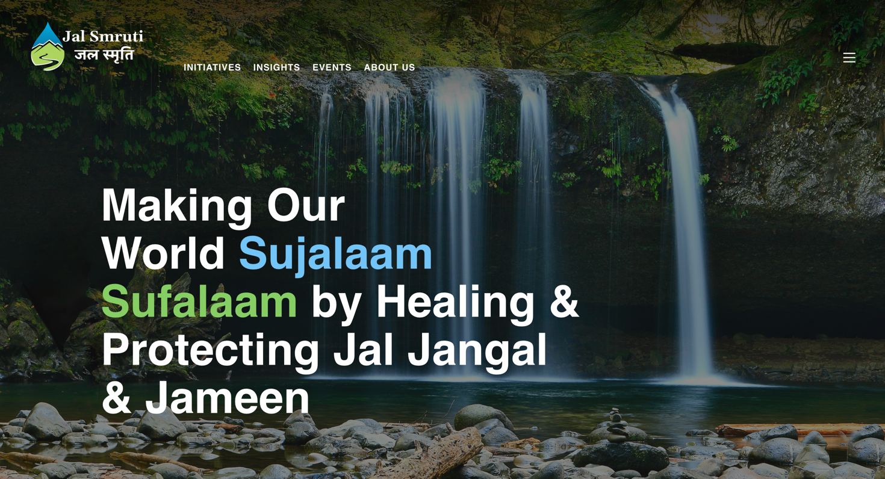
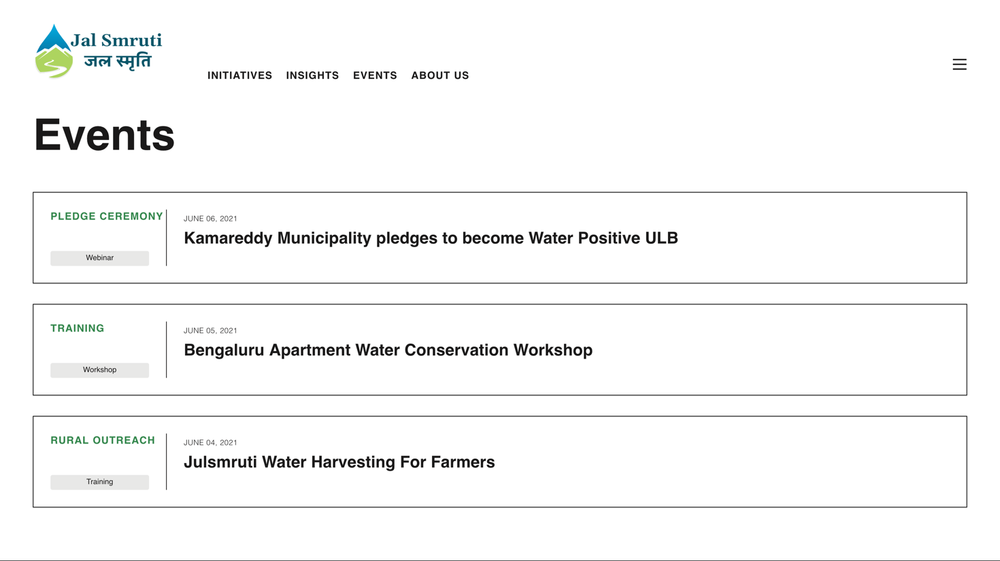
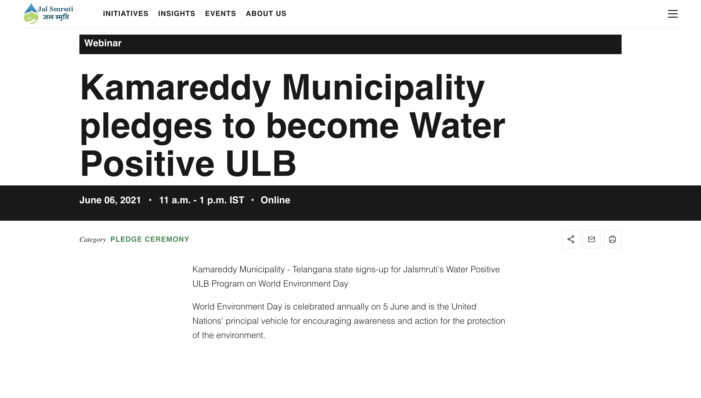
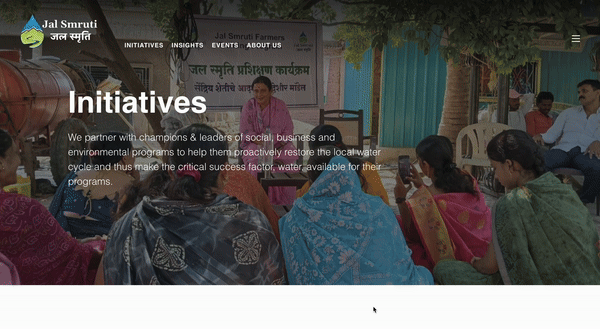
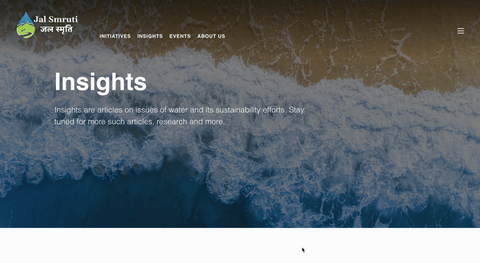
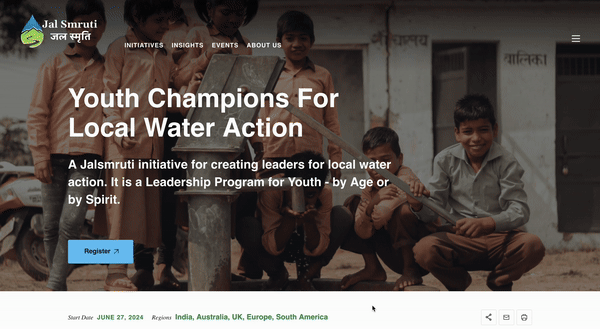
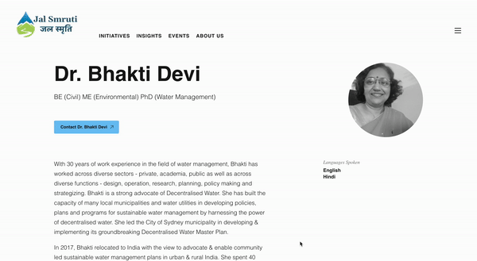

# Jalsmruti - Water Conservation NGO Website

<p align="center">
  
</p>


An open-source Django-based website template, originally developed for Jalsmruti and headed by Dr. Bhakti Devi.
Jalsmruti is a water conservation and awareness NGO. This project provides an effective platform for NGOs and non-profits 
to showcase their initiatives, manage events, share insights, and profile team members. The website was live from 2019 to 2022
and can be viewed via the [archived link](https://web.archive.org/web/20211129165745/https://jalsmruti.org/)

## Features

- **Initiative Management**: Display initiatives with detailed descriptions and progress updates.
- **Event Management**: Announce and manage bookings for upcoming events.
- **Insight Sharing**: Publish articles and insights on various topics related to the organization’s mission.
- **Team Profiles**: Showcase detailed profiles of team members and experts.
- **Contact Form**: Integrated contact form with Google reCAPTCHA for spam prevention.
- **SEO Friendly**: Dynamic sitemaps to improve search engine indexing.
- **Secure Authentication**: Robust user authentication system.
- **RESTful APIs**: Efficient APIs for seamless frontend and backend integration.
- **API Rate Throttle and Rate Limiting**: Control the rate of API requests to prevent abuse.
- **Dynamic Sections**: Sections on the site are dynamically hidden or shown based on the data inputted in the admin dashboard.

## Branding

During the early days when Jalsmruti was still taking shape, I collaborated closely with Dr. Bhakti Devi and the team to oversee the branding process. This included setting up the end-to-end brand image, managing social media presence, and establishing the technical ecosystem required to support Jalsmruti’s mission and vision.


<p align="center">
  
</p>


The logo and brand for Jalsmruti were thoughtfully designed to reflect the organization’s mission and vision in water conservation and environmental awareness. The essence of the logo lies in its symbolism, which integrates elements of nature to represent the holistic approach Jalsmruti takes towards conserving water, forests, and land.

### Design Elements

The Jalsmruti logo features a drop of water encapsulating a green landscape with a winding path leading to a mountainous horizon. This imagery is not only visually appealing but also rich in meaning:

- **Water Drop**: The primary symbol, representing water conservation, which is central to Jalsmruti’s mission.
- **Green Landscape**: Signifies the lush, fertile land that thrives with adequate water and proper conservation efforts.
- **Winding Path**: Represents the journey and ongoing efforts required to achieve sustainable environmental goals.
- **Mountainous Horizon**: Symbolizes stability, endurance, and the lofty goals of the organization to protect and heal nature.

### Brand Philosophy

Dr. Bhakti Devi, the founder of Jalsmruti, emphasized that water conservation extends beyond merely preserving water resources. It encompasses a broader mission of “Making Our World Sujalaam Sufalaam by Healing & Protecting Jal Jangal & Jameen.” This Hindi phrase translates to “Making our world lush and fertile by healing and protecting water, forests, and land.”

The philosophy behind Jalsmruti’s mission is to create a world where water is abundant and the environment flourishes. This means addressing water issues in tandem with protecting forests (Jangal) and land (Jameen). It is about a holistic approach to environmental stewardship, ensuring that water conservation efforts support and enhance the health of ecosystems and communities.

### Relation to the Logo

The logo encapsulates this comprehensive vision:

- **Healing Water (Jal)**: The water drop symbolizes efforts to conserve and manage water resources effectively.
- **Protecting Forests (Jangal)**: The green landscape represents the thriving forests that benefit from proper water management.
- **Nurturing Land (Jameen)**: The overall design illustrates a fertile and prosperous land, highlighting the interconnectedness of water, forests, and soil in sustaining life and the environment.

The Jalsmruti logo is a visual embodiment of the organization’s dedication to holistic environmental conservation, capturing the essence of its mission to heal and protect the integral components of our natural world.


## Getting Started
These instructions will help you set up the project on your local machine for development and testing purposes.

Refer to [Setup_Instructions.md](Setup_Instructions.md) for detailed setup instructions.

### Prerequisites
- Python 3.x
- Django 5.x
- Virtualenv

### Configuration
1. **ASGI Configuration**:
   The ASGI configuration is located in `jalsmruti/asgi.py`. It exposes the ASGI callable as a module-level variable named `application`.

2. **Settings Configuration**:
   The settings are located in `jalsmruti/settings.py`. The key configurations include:
   - Environment Variables: Managed with `django-environ` to keep sensitive information secure.
   - Installed Apps: Lists all Django applications and third-party apps used in the project.
   - Middleware: Includes security, session, authentication, and other middleware.
   - Database: Configured with SQLite by default, can be switched to PostgreSQL or other databases.
   - Static and Media Files: Configured paths for handling static and media files.

   Refer to [example.env](example.env) for environment variables setup in `.env`.

3. **Sitemaps Configuration**:
   Sitemaps are defined in `jalsmruti/sitemaps.py` to improve the site’s SEO by helping search engines index the site more effectively.

### Connecting to External Services
To use an external database like AWS S3 bucket and PostgreSQL hosted on AWS, follow these steps:

1. **AWS S3 Bucket for Media Files**:
    - Install the `django-storages` package:
        ```bash
            pip install django-storages[boto3]
        ```
    - Update your `settings.py`:
        ```python
      DEFAULT_FILE_STORAGE = 'storages.backends.s3boto3.S3Boto3Storage'
      AWS_ACCESS_KEY_ID = env('AWS_ACCESS_KEY_ID')
      AWS_SECRET_ACCESS_KEY = env('AWS_SECRET_ACCESS_KEY')
      AWS_STORAGE_BUCKET_NAME = env('AWS_STORAGE_BUCKET_NAME')
      AWS_S3_REGION_NAME = env('AWS_S3_REGION_NAME', default='us-east-1')
        ```

2. **PostgreSQL Database**:
    - Install the `psycopg2` package:
        ```bash
      pip install psycopg2
        ```
    - Update your `settings.py`:
        ```python
      DATABASES = {
            'default': {
                'ENGINE': 'django.db.backends.postgresql',
                'NAME': env('DATABASE_NAME'),
                'USER': env('DATABASE_USER'),
                'PASSWORD': env('DATABASE_PASSWORD'),
                'HOST': env('DATABASE_HOST', 'localhost'),
                'PORT': env('DATABASE_PORT', '5432'),
            }
        }
        ```

### Integrated Functionalities
- **Django REST Framework**:
    - Provides powerful and flexible tools for building Web APIs.
    - Used for creating API endpoints to interact with the frontend and other services.

- **Django Contrib Sitemaps**:
    - Generates sitemaps dynamically as users add new pages and blogs.
    - Improves SEO by making the site more accessible to search engine crawlers.

- **Meta**:
    - Manages metadata for SEO and social media sharing.
    - Allows easy integration of Open Graph, Twitter Cards, and other metadata.

### API Endpoints
Refer to [API_Endpoints.md](API_Endpoints.md) for detailed information on the available API endpoints.

### Database Design
Refer to [DB_Design.md](DB_Design.md) for detailed information on the database design, including table structures and
relationships.

## Deployment
Details on how to deploy this project to a live system can be found in
the [Django deployment documentation](https://docs.djangoproject.com/en/5.0/howto/deployment/).

## Screenshots and GIFs
### Home Page


### About Page


### Event Page


### Event Post Page


### Initiatives Page


### Insights Page


### Post Page


### Team Page


### Team Member Page


## Contributing
Contributions are welcome! Here are some guidelines:

1. Fork the repository.
2. Create a new branch for your feature or bugfix.
3. Commit your changes with a descriptive message.
4. Push your branch to your forked repository.
5. Create a pull request with a description of your changes.

## License

### Code License
The code in this repository is open-source and licensed under the MIT License. Please refer to the [LICENSE.md](LICENSE.md) file for the full license text.

### Content License
Any text, images, and sound content, including but not limited to those tagged with Jalsmruti, are not covered under the MIT License and are instead licensed under the terms specified by Jjala Ssmruti Foundation. For any use of such content, please contact Jjala Ssmruti Foundation for more information. For any use of such content, please contact Jalsmruti through:

- [LinkedIn](https://www.linkedin.com/company/jalsmruti/)
- [Twitter](https://twitter.com/jalsmruti)
- [Facebook](https://www.facebook.com/jalsmruti/)
- [Instagram](https://www.instagram.com/jalsmruti/)

Or reach out to the founder Dr. Bhakti Devi at [LinkedIn](https://www.linkedin.com/in/bhaktidevi/).

## Special Thanks
A special thanks to Jalsmruti, a water conservation and awareness NGO, for their dedication and impact. Please support them through their social media channels or reach out to Dr. Bhakti Devi directly on [LinkedIn](https://www.linkedin.com/in/bhaktidevi/).

## End of Life Notice
This project uses CKEditor 4, which has reached its end of life as of June 2023. Additionally, some dependencies have moved towards GPL licensing, and some are no longer maintained. Please review the licensing terms of third-party integrations to ensure compliance.

I have ensured that most libraries and versions are up-to-date as of 2024, but substantial efforts may be needed to migrate some libraries and frontend components to more modern frameworks and libraries.

For new features or support with migration, please open issues with your requests or bugs with the recent code.
